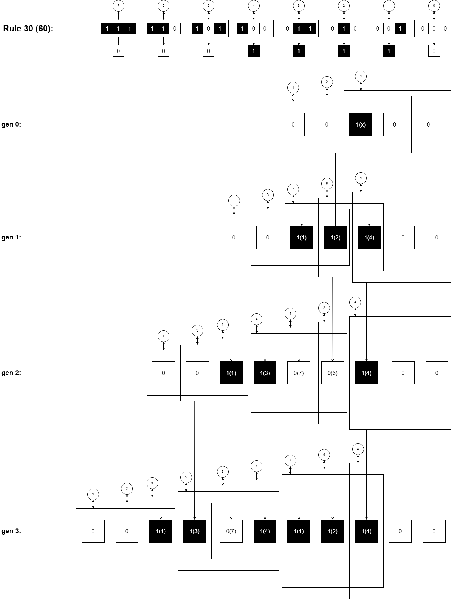

# Rule 30: Path Numbers and Interior Structure
## A structural analysis of elementary cellular automata

[](https://doi.org/10.5281/zenodo.18893849)

## Project Structure

```
rule30-structure/
│
├── README.md
├── requirements.txt                                 # numpy, sympy (two scripts only)
│
├── analysis/
│   │
│   ├── path_numbers/
│   │   └── rule_analysis_all.py                     # path number analysis for all 32 rules
│   │                                                # fixed start condition 00100, gen 0–16
│   │
│   ├── primes/
│   │   ├── rule30_analysis.py                       # path numbers for Rule 30, gen 0–127
│   │   │                                            # prime factors: system {2,3,5,7} and
│   │   │                                            # beyond boundary [!p]
│   │   └── rule30_primes.py                         # collects all prime factors > 7 that appear in the factorization
│   │                                                # of Rule 30 path numbers over a configurable generation window
│   │
│   ├── residue/ 
│   │     └── rule30_residue_classification.py       # full residue analysis after removing 
│   │                                                # system primes {2,3,5,7}; classifies 
│   │                                                # residues as resolved_to_1, prime, 
│   │                                                # prime_power, or mixed_composite 
│   │                                                # over a configurable generation window 
│   │
│   ├── interior/
│   │   ├── rule30_interior.py                       # raw interior triplet sequence, gen 0+
│   │   │                                            # isolated {1,2,4} vs collision {3,5,6,7}
│   │   ├── rule30_invariants.py                     # boundary / isolated / collision
│   │   │                                            # classification for each generation
│   │   ├── rule30_alphabet.py                       # decodes interior into 26-symbol alphabet
│   │   │                                            # greedy longest-match
│   │   ├── rule30_classes.py                        # class/chaos separation for all four
│   │   │                                            # combinative classes (A, B, C, D)
│   │   ├── rule30_class_a_layers.py                 # full layer table: gen 2, 6, 10, 14, …
│   │   ├── rule30_class_b_layers.py                 # full layer table: gen 3, 7, 11, 15, …
│   │   ├── rule30_class_c_layers.py                 # full layer table: gen 4, 8, 12, 16, …
│   │   └── rule30_class_d_layers.py                 # full layer table: gen 5, 9, 13, 17, …
│   │
│   ├── open_problems/
│   │   └── rule30_center_triplet.py                 # center bit vs center triplet analysis
│   │                                                # frequency distribution, periodicity check
│   │
│   └── 2d/
│       ├── gol_path_numbers.py                      # path number analysis for Game of Life
│       │                                            # Blinker, Glider, R-pentomino, 30 gen
│       │                                            # establishes 511 = 7 × 73 as structural root
│       ├── gol_rpentomino_primes.py                 # systematic prime analysis, R-pentomino
│       │                                            # documents stabilization at gen 1103
│       │                                            # k = 116 = 2² × 29 as terminal value
│       └── gol_rule_space.py                        # complete scan of all 2^16 outer totalistic
│                                                    # 2D rules; identifies 883 non-trivially
│                                                    # bounded rules; reduction factor ≈ 74×
│
├── diagrams/
│   ├── wegzahl_recursion_visualization.drawio       # derivation of the path number recursion
│   ├── wegzahl_recursion_visualization.png          # ↳ embedded in README (see below)
│   ├── rule30_interior_structural_invariants.drawio # boundary invariants and interior
│   ├── rule30_interior_structural_invariants.drawio.png  # classification (isolated / collision)
│   ├── rule30_interior_classes_abcd.drawio          # layer structure of all four combinative
│   └── rule30_interior_classes_abcd.drawio.png      # classes A, B, C, D
│
├── docs/
│   ├── interior_classes.md                          # full documentation of all four combinative
│   │                                                # classes, alphabet, layer tables, and
│   │                                                # comparative overview
│   └── game_of_life_path_numbers.md                 # path number method applied to 2D automata;
│                                                    # structural observations, rule space analysis,
│                                                    # 883 non-trivially bounded rules
│
└── viz/
    ├── rule30_viz.html                              # path number visualization for Rule 30
    │                                                # gen 0–127, prime factors, boundary
    │                                                # markers — open in browser
    └── rule30_all_viz.html                          # interactive visualization, all 32 rules
                                                     # sparklines, sorting, filtering
                                                     # — open in browser
```
---

## Abstract

### Background

Elementary cellular automata are one-dimensional systems in which a row of cells
(0 or 1) is transformed generation by generation according to a fixed table of
8 entries. Each of the 256 possible tables is identified by a number from 0 to
255. Rule 30 is one of the most well-known examples — starting from a single
active cell, it produces an apparently random pattern.

### Intuition

This investigation began with an alternative interpretation of how a new
generation is formed: instead of observing the output of each triplet (0 or 1),
we ask — **what is the decimal value of the input triplet itself?**

A triplet `011` is not merely a bit pattern that maps to 1 or 0 — as a decimal
number it carries the value 3. Summing the decimal values of all triplets in a
generation produces a new quantity: the **path number** (German: *Wegzahl*).

### First Observation

For Rule 30, starting from the initial condition `00100`, the path number of
generation 0 is **7**. All subsequent generations have path number values
divisible by 7:

```
Gen 0:  00100          Path number =  7
Gen 1:  0011100        Path number = 21  (= 7 × 3)
Gen 2:  001100100      Path number = 21  (= 7 × 3)
Gen 3:  00110111100    Path number = 42  (= 7 × 6)
...
```

The 7 is not a property of the rule but of the initial condition. A single 1
in a space of zeros always produces the triplets `001`, `010`, `100` with
decimal values 1, 2, 4 — their sum is always **7**.



### Structural Observation: 32 Independent Automata

Every automaton requires two zeros to the left and right of its active bits for
the recursion to terminate correctly. The zeros are not added padding — they are
the default state of the space. The minimal initial condition for a single
active 1 is therefore `00100`.

It follows that the structurally independent rule numbers are exclusively
`4, 12, 20, 28, ... 252` — multiples of 4 with step size 8. This yields exactly
**32 structurally independent automata** from the 256 possible tables.

The conventional label "Rule 30" refers to the decimal value of the output bits
`00011110` = 30. The structurally complete representation of the rule is
`00111100` = **60**, since the two trailing zeros belong to the necessary state
space of the active 1. Both designations describe the same behavior — the
structural representation makes the systematics of the 32 rules directly visible.

The script `analysis/rule_analysis_all.py` applies the path number analysis to
all 32 structurally independent automata and outputs their path number sequences
and prime factorizations over 20 generations, making the variation across the
full rule space directly comparable.

---

## Beyond One Dimension

The structural reduction from 256 to 32 rules follows from a geometric
necessity that is not specific to one dimension. In Conway's Game of Life, the
neighbourhood consists of 9 bits — yielding 2⁹ = 512 possible neighbourhood
states. A structurally complete 2D rule would need to satisfy the zero-space
boundary condition in all eight directions simultaneously. If the same principle
applies, Game of Life's rule (23/3) could occupy a structurally distinguished
position in the reduced 2D rule space — analogous to Rule 60 among the 32
one-dimensional rules. Its computational universality would then not be a
coincidence of empirical discovery but a structural consequence.

The path number method extends naturally to two dimensions: instead of triplet
decimal values, one would measure 9-bit neighbourhood values as decimal numbers
and sum them across a generation. The system boundary shifts from 7 to
2⁹ − 1 = 511 = 7 × 73. A first empirical application to Game of Life confirms
that every path number is divisible by 511 without exception — the same
structural invariance as in 1D, now with a composite root. The prime
factorization of the multiplier k (where path number = 511 × k) varies with
the collision geometry of each generation and may provide an arithmetic
signature of the observed complexity — a basis for classifying behaviour that
appears chaotic by the structure of the primes it produces rather than by its
visual appearance alone. Extended analysis of the R-pentomino shows that this
k-sequence converges to a fixed value at generation 1103 (k = 116 = 2² × 29,
116 active cells) and remains constant thereafter — every stable pattern has
a terminal arithmetic fingerprint readable directly from its path number.

Whether analogous structures emerge at larger scales — invariant boundaries,
combinative classes, prime generation beyond the system boundary — remains an
open empirical question.

Full analysis and observations: `docs/game_of_life_path_numbers.md`

---

### Structural Completeness of Rule 30

In a 3-bit binary system there are exactly 8 possible triplets with decimal
values 0–7. The prime numbers among these values are exclusively **2, 3, 5, 7**:

```
Triplet value:  0  1  2  3  4  5  6  7
Prime factor:   –  –  2  3  2  5  2  7
```

It is structurally impossible to produce a prime factor greater than 7 as a
building block — the 3-bit system knows no higher value. Every path number in
this system is a linear combination of the values 0–7 and is therefore fully
expressible through the prime factors {2, 3, 5, 7}.

Rule 30 (structurally Rule 60) has prime factors **{2, 3, 5}** — precisely all
primes below the structural maximum prime 7. It is the only rule among the 32
that unites all prime factors below the system boundary. The 7 itself is the
maximum prime factor of the system and simultaneously the root of all path
number values — it emerges necessarily from the initial condition `00100` as the
sum 1+2+4.

Every number in the system can be reduced to 1 by repeated division through its
prime factors (fundamental theorem of arithmetic) — and all of these prime
factors lie structurally within the boundaries of the 3-bit binary system.

In the structural enumeration of the 32 valid rules (4, 12, 20, 28, 36, 44, 52,
60, …), Rule 60 occupies position **8** — the only position in the first half
of the rule space that is itself a power of 2, and equal to 2³, the cube of the
system's binary base. The conventional label Rule 30 obscures this: it is an
artifact of reading the output bits as a decimal number without accounting for
the two structurally necessary trailing zeros. The structural label Rule 60
makes its position within the 32-rule system immediately visible, and places it
exactly where its prime factor completeness would suggest it belongs.

### Prime Factors Beyond the System Boundary

While the building blocks of the 3-bit system are limited to the prime factors
{2, 3, 5, 7}, the path number values produced by the recursion can contain prime
factors larger than 7. Analysis of the first 1024 generations reveals exactly
**139 distinct prime factors** beyond the system boundary:

```
Within system:   2, 3, 5, 7

Beyond boundary (sorted):
11, 13, 17, 19, 23, 29, 31, 37, 41, 43, 47, 53, 59, 61, 67, 71, 73, 79, 83,
89, 97, 101, 103, 107, 109, 113, 127, 131, 137, 139, 149, 151, 157, 163, 167,
173, 179, 181, 191, 193, 197, 199, 211, 223, 227, 229, 233, 239, 241, 251, 257,
263, 269, 271, 277, 281, 283, 293, 307, 311, 313, 317, 337, 347, 349, 353, 367,
373, 379, 383, 389, 397, 401, 419, 431, 433, 439, 443, 449, 457, 461, 463, 467,
479, 491, 499, 503, 509, 521, 523, 547, 563, 571, 577, 587, 593, 599, 601, 607,
641, 643, 653, 659, 673, 677, 691, 701, 709, 727, 733, 739, 743, 751, 757, 769,
773, 787, 809, 821, 823, 829, 853, 857, 859, 877, 883, 887, 907, 911, 919, 929,
937, 947, 953, 967, 983, 997, 1021, 1031
```


Two structural properties hold consistently across the analysed window:

1. Every prime factor beyond the system boundary appears **together with**
   factors from {2, 3, 5, 7}. In particular, the factor 7 is always present as
   an anchor because it is generated directly by the initial condition `00100`
   (the triplet values 1 + 2 + 4 = 7).

2. All factors recorded outside the boundary are **prime factors of the path
   numbers themselves**, obtained from the full prime factorization of each
   value.

The script `analysis/primes/rule30_analysis.py` shows these factors generation
by generation, marking every prime outside the system boundary with `[!p]`.
The script `analysis/primes/rule30_primes.py` collects all such prime factors
over a configurable number of generations and reports unique factors, order of
first appearance, and which primes below the largest observed value have not
yet appeared.

To complement this factor analysis, the script
`analysis/residue/rule30_residue_classification.py` examines the **entire
reduced residue** obtained after removing all factors from {2, 3, 5, 7} from
each path number. The resulting residues are classified into four categories:

- `resolved_to_1`
- `prime`
- `prime_power`
- `mixed_composite`

For the first 1024 generations the distribution is:
```
resolved_to_1: 141
prime: 753
prime_power: 15
mixed_composite: 115
```

Thus the reduced residues are **dominated by arithmetically simple values**,
with primes forming the large majority, but composite residues clearly present.


#### Arithmetic Bias in the Residue Sequence

The combined analysis suggests that the arithmetic structure of the path number
sequence is **not arbitrary**. After removing the system factors {2, 3, 5, 7},
the remaining residues are strongly biased toward simple forms — most often a
single prime, occasionally a prime power, and only comparatively rarely a
mixed composite number.

This bias appears to arise from the geometric dynamics of the automaton. The
interior evolution of Rule 30 consists of independently propagating regions
that interact through collisions producing the triplet values {3, 5, 6, 7}.
These collisions introduce the arithmetic variability that ultimately
determines the factor structure of each path number.

The extraction method is correspondingly simple: since every path number is
divisible by 7 (a direct consequence of the initial condition `00100`),
removing the system factors {2, 3, 5, 7} isolates the arithmetic contribution
generated by the recursion itself.

The observations reported here are **empirical rather than theoretical**. What
remains open is how the interior structure documented in
`docs/interior_classes.md` — the layer hierarchy, the four combinative classes,
and the R-coupling — constrains the arithmetic form of the resulting path
numbers, and whether the observed bias toward simple residues persists over
much longer generation windows. The connection between the collision geometry
of the automaton and the arithmetic structure of its path number sequence
remains the central open question raised by this analysis.


### The Zero Space as Ground State

The zeros are not padding that is added. The space is zero everywhere — the 1
is the only active element that exists within it and propagates according to the
rules of the respective automaton. The path number measures not the output of
the rule, but the **structural complexity of the input state** — regardless of
what the rule does with it.

---

### Interior Structure of Rule 30

A further analysis of the interior — the region between the invariant left
boundary `1, 3, 6` and the invariant right boundary `4` — reveals that the
apparently chaotic region carries a precise internal structure. This was not
assumed but discovered through a sequence of increasingly refined analyses.

#### The Analytical Path

The investigation began with `analysis/interior/rule30_interior.py`, which strips the
known invariant boundaries and displays the raw interior triplet sequence for
each generation. This immediately shows the alternation between isolated values
{1, 2, 4} — echoes of the initial condition propagating through empty space —
and collision values {3, 5, 6, 7} — the only positions where genuinely new
configurations are produced.

`analysis/interior/rule30_invariants.py` made this separation explicit by classifying
every interior triplet value as boundary, isolated, or collision for each
generation. The resulting output showed that even generations consist
predominantly of isolated values while odd generations consist predominantly
of collision values — a structural alternation that follows directly from how
active regions propagate and meet.

With the interior classified, `analysis/interior/rule30_alphabet.py` introduced a fixed
26-symbol alphabet in which each symbol encodes a specific sequence of
consecutive triplet values. Decoding each generation's interior into this
alphabet revealed that the interior is not random symbol noise but a sequence
that decomposes into recognizable, recurring structures.

`analysis/interior/rule30_classes.py` then showed that the decoded interior belongs to
one of four **combinative classes** (A, B, C, D) rotating on a four-generation
cycle. Each class builds up a fixed core sequence over its first eight
repetitions, after which the core stabilizes permanently.

The four class layer scripts (`rule30_class_a_layers.py` through
`rule30_class_d_layers.py`) document the full stable phase of each class:
layer contributions concatenate into two growing symbol sets that alternate
pairwise as a unit, with the alternation period doubling each time a new layer
stabilizes.

#### Structure of the Stable Interior

Once the core is stable, each generation's interior reads:

```
  A  |  Core  |  L1 … Ln  |       Chaos       |  R  |  C
fixed  stable   ← two alternating sets →   grows unbounded  alt  fixed
```

- **A**: invariant left boundary symbol, always present
- **Core**: class-specific fixed sequence, stable after 8 repetitions
- **L1 … Ln**: layer contributions that concatenate into two symbol sets
  alternating pairwise as a unit; the period doubles with each new layer
  (2, 4, 8, 16, 32, … repetitions); further layers are expected beyond
  the analyzed window
- **Chaos**: genuinely unstructured region between the last confirmed layer
  and R; grows without bound
- **R**: right alternating segment coupled to the layer structure; its
  behaviour varies significantly across the four classes
- **C**: invariant right boundary symbol, always present

The four classes differ not only in their cores and layer tokens but in the
behaviour of R — ranging from a fixed constant (Class C) through a simple
parity signature (Class A) and an independent two-symbol alternation (Class D)
to a hierarchical period-doubling sequence in Class B whose full extent requires
alphabet symbols not yet observed and not yet defined.

This does not resolve the prize problems and does not reduce the complexity of
Rule 30 — the chaos region remains genuinely unstructured and grows without
bound. What it establishes is that order and chaos coexist within the same
interior, with a structured region whose boundary advances outward as new layers
stabilize, and a chaos region that grows alongside it.

Full documentation of all four classes, the alphabet, the layer tables, and the
comparative overview: `docs/interior_classes.md`

---

## Structural Implications for the Three Open Problems

Rule 30, introduced by Stephen Wolfram, has three associated open problems,
originally posed in connection with a prize competition. They concern the center
column of the automaton: whether it is non-periodic, whether 0 and 1 appear
with equal frequency, and whether computing the nth value requires at least O(n)
effort.

These three questions are worth examining not because of the prize, but because
they target precisely the properties of Rule 30 that would need to hold for it
to function as a reliable source of randomness and computational irreducibility.
If any of them were resolved in the negative — if a period were found, or a
shortcut computation — the structural foundations of the automaton would be
fundamentally different from what is currently assumed.

The structural analysis developed in this project — the path number, the
invariant boundaries, the combinative classes, the hierarchical layer structure
of the interior, and the prime generator behaviour — does not resolve these
problems in the formal sense. What it does is make their answers structurally
plausible from first principles: the same properties of the automaton that
produce the observed order also constrain the system in ways that make
periodicity, equal distribution, and computational irreducibility the expected
outcome rather than a coincidence. The following sections develop this argument
for each problem in turn.

---

### Problem 1: Does the center column always remain non-periodic?

The prize problem asks whether the sequence of center cell values — a sequence
of 0s and 1s — ever becomes periodic. This is a natural question if one treats
each cell as an independent unit.

However, a single cell is structurally always the **middle bit of a triplet**.
In a 3-bit system, a cell carries meaning only in relation to its two neighbors —
together they form a number between 0 and 7. Observing the center bit in
isolation discards two thirds of the structural information at each step.

A more complete question would be: does the sequence of **center triplet values**
(the decimal value of the triplet formed by the left neighbor, center cell, and
right neighbor) ever become periodic?

This is a fundamentally different question. The center triplet sequence has a
state space of 8 possible values (0–7) instead of 2, and it captures the full
local context of the center at each generation:

```
Gen 0:  center triplet (0,1,0) = 2
Gen 1:  center triplet (1,1,1) = 7
Gen 2:  center triplet (1,0,0) = 4
Gen 3:  center triplet (0,1,1) = 3
Gen 4:  center triplet (0,1,0) = 2
...
```

The center triplet sequence for the first 64 generations shows no periodicity,
and all 8 possible values appear with roughly equal frequency — which is a more
precise and structurally complete statement than non-periodicity of a binary
sequence.

The interior structure documented in `docs/interior_classes.md` strengthens this
further: the four combinative classes rotate on a strict four-generation cycle,
and each class carries a layer hierarchy whose period doubles without bound. A
periodic center column would require this unbounded period-doubling structure to
eventually repeat — which would contradict the open-ended growth of the layer
hierarchy itself.

The script `analysis/open_problems/rule30_center_triplet.py` computes both sequences side by
side and checks for periodicity in the center triplet sequence.

### Problem 2: Does each color occur on average equally often in the center column?

The prize problem asks whether black and white cells appear with equal frequency
in the center column as the number of steps grows toward infinity — that is,
whether the limiting ratio is exactly 1. Empirically the ratio converges closely
toward 1 over billions of steps, but a proof remains open.

As with Problem 1, the question treats each center cell as an independent binary
event. From a structural perspective this is again a reduction: a single bit
carries no complete value in a 3-bit system. The statistically meaningful unit
is the center triplet, which takes one of 8 possible values (0–7).

The reformulated question for Problem 2 would therefore be: do all 8 center
triplet values occur with equal frequency in the limit? This is a stronger and
structurally more complete statement — equal distribution over 8 values implies
equal distribution over the binary projection, but not vice versa.

The four-generation rotation of the combinative classes is relevant here: each
class contributes its own characteristic symbol set to the interior, and the
center column passes through all four classes in strict rotation. Equal
distribution in the limit would require that the combined output of all four
classes across all generations produces no systematic bias — a condition that
the symmetric structure of the four-class rotation makes plausible but does not
prove.

---

### A Shared Structural Limit of Problems 1 and 2

Both problems ask about properties of a sequence that can only be known by
running the recursion. This points to a deeper constraint.

One might ask whether a separate recursion could be defined that produces the
center triplet values directly — without running the full automaton — and whether
such a recursion could then be analyzed for periodicity or distribution. This
would be the natural path toward a proof.

However, the center triplet values at each generation are themselves **outputs
of the path number recursion**. The state of the automaton at generation n is
produced by applying the rule n times to the initial condition. There is no
instance that knows these values before the recursion produces them. A
pre-recursion that generates center triplet values ahead of the automaton would
require knowing the result before performing the computation — a direct
contradiction.

This means that both Problem 1 and Problem 2, if reformulated in terms of center
triplets, cannot be resolved by finding a shortcut recursion. The sequence is
only accessible through the automaton itself. Any proof must therefore reason
about the global structure of the recursion — not about an alternative generator
for its outputs.

---

### Structural Invariants at the Boundary

Before addressing Problem 3, an observation about the geometry of the automaton
that strengthens the structural argument for all three problems.

To describe the interior of the automaton precisely, two categories of triplet
values must be defined:

**Isolated values {1, 2, 4}**: triplet values that arise when an active 1 has
no active neighbors — it exists in isolation within the zero space. A single 1
surrounded by zeros always produces the triplets `001 = 1`, `010 = 2`, `100 = 4`.
These are not decisions of the automaton but geometric necessities: wherever a 1
propagates through empty space, these three values repeat. They are echoes of
the initial condition `00100` traveling through the zero space.

**Collision values {3, 5, 6, 7}**: triplet values that arise at contact points
between two active regions — where the neighborhoods of two independently
propagating active areas overlap. At these positions a cell's triplet contains
active bits from two distinct sources simultaneously. These are the only
positions where genuinely new structural configurations are produced. The
apparent chaos of Rule 30 is localized entirely within collision values.

Note: the values 3 and 6 appear both as invariant boundary values and as
collision values in the interior. At the boundary they represent a structurally
forced collision between the growing pattern and the zero space — always
identical in form, hence invariant. In the interior they represent variable
collisions between independently propagating regions — hence part of the chaos.

With these definitions, the structure of the automaton becomes fully transparent.
Analysis of the triplet sequence across all generations reveals that the
**outermost active triplets are invariant** — they never change:

```
Left boundary:   001 = 1,  011 = 3   (always, every generation ≥ 1)
Right boundary:  100 = 4              (always, every generation ≥ 1)
```

This is not an empirical observation but a logical consequence of the rules and
the initial condition `00100`. The rule maps `111 → 0`, which means that any
leading 1 requires exactly two zeros to its left to produce a new active cell.
This forces `001` and `011` permanently at the left edge, and `100` permanently
at the right edge — these are boundary collisions with the zero space, fixed
for all time.

The invariant boundary extends further inward as the automaton develops. From
generation 2 onward, the first three active triplet values are permanently fixed:

```
Gen 2+: left boundary always begins with  1, 3, 6  (001, 011, 110)
```

This follows necessarily from the pattern `0011` which the left edge establishes
at generation 1 and never abandons. The sequence `0011` always produces the
triplets `001 = 1`, `011 = 3`, `110 = 6` — without exception. The complete
picture of structural invariants is therefore:

```
Gen 0:   1, 2, 4                              (initial condition)
Gen 1:   1, 3, [7], 6, 4                      (first split)
Gen 2+:  1, 3, 6, [ ... interior ... ], 4     (left invariant fully established)
```

The automaton has three distinct layers:

1. **Boundary** (from Gen 2): always `1, 3, 6` on the left, `4` on the right —
   invariant forced collisions with the zero space
2. **Isolated interior**: values `{1, 2, 4}` — echoes of the initial condition
   propagating through gaps in the zero space
3. **Collision interior**: values `{3, 5, 6, 7}` — contact points between active
   regions, the only source of genuinely new configurations

A further pattern emerges across generations: even generations consist
predominantly of isolated values in the interior, odd generations predominantly
of collision values. This alternation is itself a structural consequence of how
active regions propagate and meet.

The script `analysis/interior/rule30_invariants.py` demonstrates all three layers by
showing boundary, isolated, and collision values separately for each generation.

The structural layering extends further into the interior than the invariant
boundary alone suggests. Decoding the interior through the 26-symbol alphabet
reveals four distinct combinative classes, each occupying every fourth
generation, each building a fixed core and then accumulating layer contributions
whose alternation period doubles without bound. The interior is therefore not a
uniform chaos: a structured region of confirmed, permanent order coexists with a
genuinely chaotic region, separated by a boundary that advances outward at a
determinate rate. Full documentation: `docs/interior_classes.md`

### Problem 3: Does computing the nth cell require at least O(n) computational effort?

The direct method to find the nth cell of the center column is to run the
automaton for n steps, computing all intermediate states. This requires ½n²
individual cell updates — a computational effort of O(n²). Problem 3 asks
whether a shortcut exists: can the nth center cell be computed in less than O(n)
effort, without computing all intermediate generations?

This is a question from computational complexity theory. A solution in less than
O(n) would mean that the nth value can be determined without having seen all
preceding states — that some property of the system allows skipping generations.

The structural analysis developed here suggests that no such shortcut exists,
and that this follows directly from the same constraint identified for Problems
1 and 2.

The automaton propagates a single active 1 through a space of zeros according
to strictly local neighborhood rules. Each generation is fully determined by its
predecessor — and only by its predecessor. The collision values that constitute
the interior chaos are produced exclusively at contact points between active
regions — and those contact points only exist after the isolated values from
previous generations have propagated far enough to meet. There is no global
formula, no closed-form expression, no property of generation n that can be
derived without passing through generations 1 through n−1.

The path number analysis confirms this: the prime factors of each generation's
path number — including the primes beyond the system boundary that appear as
collision products — are emergent results of the recursion, not properties that
can be read off from n directly. The interior structure reinforces the same
point: the layer hierarchy of each combinative class stabilizes progressively,
with each new layer requiring more generations to appear than the last. There is
no generation at which the full structure is known in advance.

A shortcut computation in less than O(n) would therefore require knowing the
collision structure of generation n without having produced the isolated
propagation of generations 1 through n−1. This is the same logical
impossibility already identified for the pre-recursion argument in Problems
1 and 2 — restated in the language of computational complexity.

The conjecture that O(n) is a lower bound for this computation is therefore not
merely plausible but follows from the irreducible sequential structure of the
recursion itself: collisions cannot precede the propagation that causes them.

---

## Scripts

### `analysis/primes/rule30_analysis.py`

Computes step-by-step the path number values for Rule 30 over 128 generations.
Shows for each generation the bit pattern, binary value, path number, and its
prime factorization. Prime factors within the system boundary {2, 3, 5, 7} are
shown directly. Prime factors beyond the boundary are marked with `[!p]`.

```bash
python3 analysis/primes/rule30_analysis.py
```

### `analysis/path_numbers/rule_analysis_all.py`

Applies the same path number analysis to all 32 structurally independent rules.
The initial condition is always `00100`, the root always 7.
Output: rule number, prime factors of the rule, path number values over
generations 0–16.

```bash
python3 analysis/path_numbers/rule_analysis_all.py
```

### `analysis/primes/rule30_primes.py`

Collects all prime factors from path number values that exceed the system
boundary of 7, over a configurable number of generations (set `GENS` at the
top of the script). Outputs all occurrences with repetition, unique primes in
order of first appearance, unique primes sorted, and which primes below the
largest found are not yet observed.

```bash
python3 analysis/primes/rule30_primes.py
```

### `analysis/interior/rule30_interior.py`

Strips the known invariant boundaries and displays the raw interior triplet
sequence for each generation, classified into isolated values {1, 2, 4} and
collision values {3, 5, 6, 7}. Entry point for the interior investigation.

```bash
python3 analysis/interior/rule30_interior.py
```

### `analysis/interior/rule30_invariants.py`

Classifies every interior triplet value as boundary, isolated, or collision for
each generation. Makes the three-layer structure of the automaton explicit and
directly comparable across generations.

```bash
python3 analysis/interior/rule30_invariants.py
```

### `analysis/interior/rule30_alphabet.py`

Decodes any generation's interior into the 26-symbol alphabet. Each symbol
encodes a specific sequence of consecutive triplet values; matching is greedy,
longest first. The alphabet reflects sequences observed up to the generations
analyzed and will likely grow as further generations are computed.

```bash
python3 analysis/interior/rule30_alphabet.py
```

### `analysis/interior/rule30_classes.py`

Separates the decoded interior into class region and chaos region for all four
combinative classes. Shows the class prefix growing toward its stable core
across the build-up phase.

```bash
python3 analysis/interior/rule30_classes.py
```

### Interior Layer Tables

| Script                                            | Generations     | Description                                                 |
|---------------------------------------------------|-----------------|-------------------------------------------------------------|
| `analysis/interior/rule30_class_a_layers.py`      | 2, 6, 10, 14, … | full layer table with alphabet legend and structure diagram |
| `analysis/interior/rule30_class_b_layers.py`      | 3, 7, 11, 15, … | full layer table with alphabet legend and structure diagram |
| `analysis/interior/rule30_class_c_layers.py`      | 4, 8, 12, 16, … | full layer table with alphabet legend and structure diagram |
| `analysis/interior/rule30_class_d_layers.py`      | 5, 9, 13, 17, … | full layer table with alphabet legend and structure diagram |

```bash
python3 analysis/interior/rule30_class_a_layers.py
python3 analysis/interior/rule30_class_b_layers.py
python3 analysis/interior/rule30_class_c_layers.py
python3 analysis/interior/rule30_class_d_layers.py
```

### `analysis/open_problems/rule30_center_triplet.py`

Computes for each generation both the center bit (as in the original prize
problem formulation) and the center triplet decimal value (0–7). Shows the
frequency distribution of all 8 possible triplet values and checks for
periodicity in the triplet sequence.

```bash
python3 analysis/open_problems/rule30_center_triplet.py
```

### 2D Automata

| Script                             | Description                                                                                     |
|------------------------------------|-------------------------------------------------------------------------------------------------|
| `analysis/2d/gol_path_numbers.py`      | path number analysis for Game of Life, three start conditions (Blinker, Glider, R-pentomino), 30 generations; establishes 511 = 7 × 73 as structural root; confirms full divisibility by 511 |
| `analysis/2d/gol_rpentomino_primes.py` | systematic prime factor analysis of the R-pentomino over a configurable generation window; tracks the multiplier k in path number = 511 × k; documents stabilization at gen 1103 with terminal value k = 116 = 2² × 29 |
| `analysis/2d/gol_rule_space.py`        | complete scan of all 2^16 structurally valid outer totalistic 2D rules; classifies single-cell behaviour; identifies 883 non-trivially bounded rules; reduction factor ≈ 74× |

```bash
python3 analysis/2d/gol_path_numbers.py
python3 analysis/2d/gol_rpentomino_primes.py
python3 analysis/2d/gol_rule_space.py
```

`gol_rpentomino_primes.py` requires `numpy` and `sympy`. The other two 2D
scripts require `numpy` only. See `requirements.txt`.

Full analysis and observations: `docs/game_of_life_path_numbers.md`

### `viz/rule30_viz.html`

Visualization of the path number development for Rule 30 over 128 generations.
For each generation: path number, system prime factors {2, 3, 5, 7}, and primes
beyond the system boundary highlighted in orange. Open in browser.

### `viz/rule30_all_viz.html`

Interactive visualization of all 32 structurally independent rules. Shows
sparklines of path number development, prime factors of the rule number,
sorting and filtering. Open in browser.

## Contact

For questions, feedback, or discussion: open a
[GitHub Issue](https://github.com/elijasgogu/rule30-structure/issues).

For direct contact: see the email address on my
[GitHub profile](https://github.com/elijasgogu).